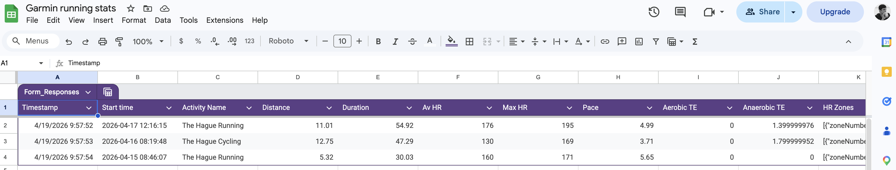

# Garmin to Google Sheets Sync

This application fetches your running stats from Garmin Connect and writes them to a Google Sheet via a Google Form to avoid the need for a Google Cloud project.

## Prerequisites

- Python 3.12+
- `uv` for dependency management

## Setup

### 1. Project Environment

Copy the `.env.example` file to `.env` and fill in your Garmin credentials:

```bash
cp .env.example .env
```

Edit `.env`:
```env
GARMIN_EMAIL=your_email@example.com
GARMIN_PASSWORD=your_password
GOOGLE_FORM_URL=https://docs.google.com/forms/d/e/YOUR_FORM_ID/formResponse

# And fill in the entry IDs for your form fields
ENTRY_START_TIME=entry.XXXXXX
ENTRY_NAME=entry.XXXXXX
# ... see .env.example for all fields
```

### 2. Google Sheets & Form Setup

Instead of setting up a complex Google Cloud project or an Apps Script, we use a Google Form linked to a Google Sheet. This allows submitting data via HTTP POST without authentication overhead.

1.  Create a new **Google Form**.
2.  Add questions for each field you want to log (Start Time, Name, Distance, Duration, Avg HR, Max HR, Pace, TE Aerobic, TE Anaerobic, HR Zones).
3.  Link the form to a **Google Sheet** (in the Form's "Responses" tab, click "Link to Sheets").
4.  Get the **Pre-filled URL** to find the `entry.XXXXXX` IDs for each field:
    -   In the Form editor, click the three dots (top right) > **Get pre-filled link**.
    -   Fill in test values for each field and click **Get link**.
    -   Copy the link and extract the `entry.XXXXXX` numbers from the URL query parameters.
5.  Fill in the `GOOGLE_FORM_URL` (it should end in `/formResponse`) and the `ENTRY_` IDs in your `.env` file.

## Installation & Running

Install dependencies and run the script using `uv`:

```bash
uv lock
uv run sync_stats.py
```

*Note: If you encounter permission issues with `uv` in your environment, you can try setting local directories for cache and python installations:*
```bash
UV_PYTHON_INSTALL_DIR=.uv_python UV_CACHE_DIR=.uv_cache uv lock
UV_PYTHON_INSTALL_DIR=.uv_python UV_CACHE_DIR=.uv_cache uv run sync_stats.py
```

## Form Example


## TODOs
- [ ] Setup a cron job or GitHub Actions to run the script periodically.
- [ ] Deduplicate records (ensure same activity is not logged multiple times).
- [ ] (Stretch) Add an agent to analyze the stats.
