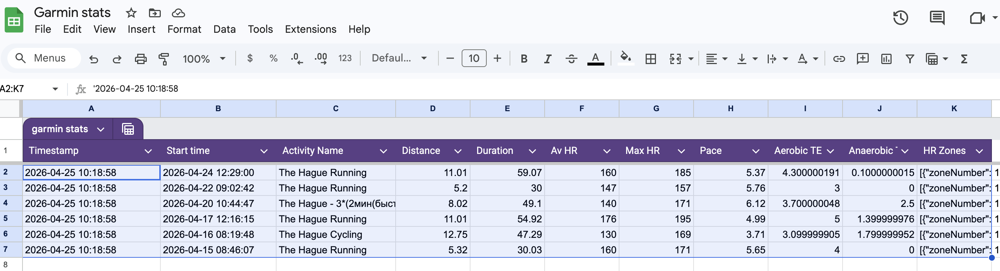

# Garmin & Strava to Google Sheets Sync

This application fetches your running/fitness stats from either Garmin Connect or Strava and writes them directly to a Google Sheet using the `gspread` library.

## Prerequisites

- Python 3.12+
- `uv` for dependency management (`pip install uv`)

## Setup

### 1. Select Your Sync Source (Garmin or Strava)

Create or edit `config.yaml` in the project root:

```yaml
# Choose whether to sync from Garmin or Strava. Options: garmin, strava
sync_source: garmin
```

By default, it is set to `garmin`.

### 2. Project Environment

Copy the `.env.example` file to `.env` and fill in the credentials for your selected sync source:

```bash
cp .env.example .env
```

### 3. Garmin Credentials Setup (If using Garmin)

Add the following to `.env`:
```env
GARMIN_EMAIL=your_email@example.com
GARMIN_PASSWORD=your_password
SPREADSHEET_ID=your_spreadsheet_id
```

### 4. Strava API Setup (If using Strava)

To sync from Strava, you need to register a Strava API Application:

1. Go to [Strava Developers getting started guide](https://developers.strava.com/docs/getting-started/) and log in to Strava.
2. Navigate to [My API Application](https://www.strava.com/settings/api).
3. Fill in the application details:
   - **Application Name**: e.g., `Garmin Sheet Sync`
   - **Category**: e.g., `Other` or `Data Importer`
   - **Club**: (Optional, leave blank)
   - **Website**: `http://localhost`
   - **Authorization Callback Domain**: `localhost`
4. Click **Create**. You will be shown your **Client ID** and **Client Secret**.
5. Add these credentials to your `.env` file:
   ```env
   STRAVA_CLIENT_ID=your_strava_client_id
   STRAVA_CLIENT_SECRET=your_strava_client_secret
   ```
6. **First Run Authentication**:
   On the very first run of the sync script with Strava enabled, it will open your web browser prompting you to authorize the application's read permissions. After you click **Authorize**, your browser will redirect to a localhost URL (e.g., `http://localhost/exchange_token?state=&code=abcdef...&scope=read,activity:read`).
   - Copy the **entire URL** from the browser address bar.
   - Paste the URL into the terminal prompt: `Please paste the url obtained after granting the scopes:`
   - Press **Enter**. The application will exchange the code for your credentials, automatically save them in `.strava.secrets`, and handle all future access token refreshes fully hands-free.

### 5. Google Sheets Setup (via `gspread`)

For a clean integration, we use the `gspread` library with a Google Cloud Service Account.

1. Go to the [Google Cloud Console](https://console.cloud.google.com/) and create a project.
2. Enable the **Google Sheets API**.
3. Go to **IAM & Admin > Service Accounts**, create a Service Account, and download a **JSON key**.
4. You have two options for managing this key:
   - **Option A (Local File):** Rename the downloaded file to `service_account.json` and place it in this project root.
   - **Option B (Secret Manager):** Store the contents of the JSON key in Google Cloud Secret Manager.
     1. Enable the **Secret Manager API**.
     2. Create a secret and paste the JSON key content as the secret value.
     3. Add `GARMIN_SHEET_SECRET_NAME` to your `.env` file with the full resource name (e.g., `projects/YOUR_PROJECT_ID/secrets/YOUR_SECRET_NAME/versions/latest`).
     4. Ensure the environment where you run the script has access to Google Cloud credentials (e.g., via `gcloud auth application-default login` or a service account attached to the resource).
5. **Share** your Google Sheet with the Service Account email (found in the JSON file) as "Editor".
6. Add `SPREADSHEET_ID` to your `.env` file.

## Installation & Running

You can use the provided `Makefile` for common commands:

```bash
make sync
```

Or run the script using `uv` directly:

```bash
uv lock
uv run python -m src.sync_stats
```

## Automation with crontab

To run the sync automatically and handle cases where the laptop is asleep at the scheduled time, you can use `crontab`.

1. Open your crontab for editing:
   ```bash
   crontab -e
   ```

2. Add the following entry to run the script every 1 hour:
   ```cron
   0 * * * * cd /Users/kashnitsky/Documents/garmin_sheet && make sync >> garmin_sync.log 2>&1
   ```
   The script includes logic to ensure it only performs the sync once per hour, so running it every hour allows it to catch up if the laptop was asleep.

3. Verify the cron job is active:
   ```bash
   crontab -l
   ```

**Example of fetched data**


## Analysis with Gemini

In a Gemini Chat or Gem, ask:

```
Based on my latest running stats from <link to the sheet>, provide me and advice
on how to improve my running performance.
```